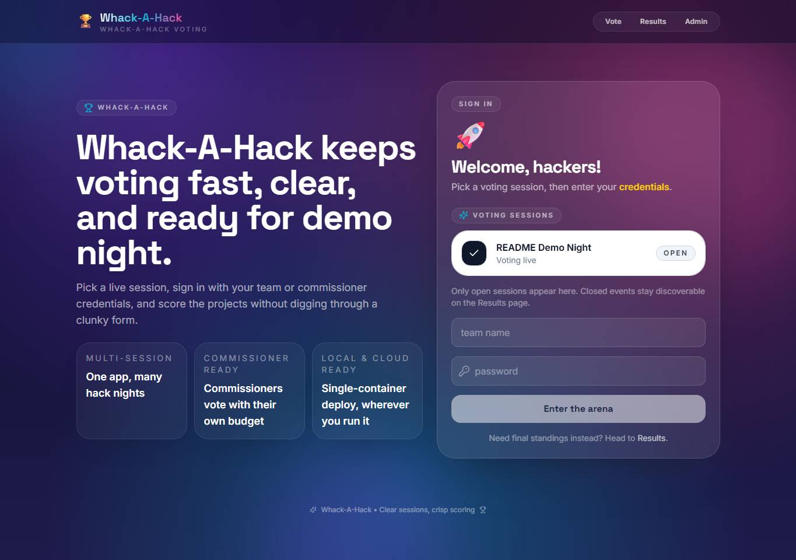

# Whack-A-Hack

**Whack-A-Hack** is a single-container hackathon voting app. Admins create voting sessions, teams and the commissioner sign in with session-scoped credentials, votes are validated in the Node + SQLite backend, and final standings unlock when voting closes.

## First page



The default unauthenticated flow lands on the voting experience, which redirects to the login page until a team or commissioner signs in.

## Local usage

### Native development

Requires Node 20+.

1. Install dependencies:

   ```bash
   npm run install:all
   ```

2. Copy `server/.env.example` to `server/.env` and set your own `ADMIN_CODE` and `COOKIE_SECRET`.
3. Start the app:

   ```bash
   npm run dev
   ```

4. Open `http://localhost:5173`.
   - Vite serves the UI on `:5173`
   - the Express API runs on `:8080`
   - `/admin` uses the `ADMIN_CODE` value from `server/.env`

SQLite data is stored in `server/data/voting.db`. Reset local state with:

```bash
npm run dev:reset
```

### Local production-style container

Use the included compose file when you want the same single-container shape used for deployment:

1. Create a repo-root `.env` file for Docker Compose with your own values:

   ```dotenv
   ADMIN_CODE=choose-a-local-admin-code
   COOKIE_SECRET=choose-a-long-random-cookie-secret
   ```

2. Start the container:

```bash
docker compose up --build
```

3. Open `http://localhost:8080`.

- Admin login code: the `ADMIN_CODE` value from your repo-root `.env`
- Persistent data directory: `./.localdata`

## What the app does

- Creates multiple voting sessions with separate team and commissioner point budgets.
- Auto-creates a commissioner account for each session.
- Lets admins add teams manually or bulk-generate animal-themed team names with passwords.
- Prevents self-voting and keeps votes isolated per session.
- Shows live admin results during voting and public results only after a session is closed.

## Deployment

### Recommended path: self-hosted single container

The current app architecture is designed around one Node container:

- the React app is built into `server/public`
- Express serves both the SPA and `/api`
- SQLite persists under `DATA_DIR`
- production should mount persistent storage at `/data`

Build and run it directly:

```bash
docker build -t whack-a-hack .
docker run -d --name whack-a-hack -p 8080:8080 -e ADMIN_CODE=change-me -e COOKIE_SECRET=replace-with-a-long-random-secret -e DATA_DIR=/data -v whack-a-hack-data:/data whack-a-hack
```

If you prefer, `docker-compose.yml` is already set up as the simplest starting point for local or small self-hosted installs, but it expects `ADMIN_CODE` and `COOKIE_SECRET` to be supplied by the caller.

### Azure Container Apps via Bicep

The repo now includes **generic Azure Bicep** under `infra/` for deploying the same single-container app to **Azure Container Apps** with:

- external ingress on port `8080`
- Azure Files mounted at `/data` for SQLite persistence
- secure deployment parameters for `ADMIN_CODE` and `COOKIE_SECRET`
- no baked-in subscription IDs, resource group names, or personal Azure details

Suggested flow:

1. Build and publish your image to a registry you control.
2. Create or choose a resource group in the Azure subscription you want to use.
3. Review `infra/main.parameters.example.json` and adjust the non-secret values.
4. Deploy the stack with your own secure values:

```bash
az group create --name <resource-group> --location <azure-region>
az deployment group create \
  --resource-group <resource-group> \
  --template-file infra/main.bicep \
  --parameters @infra/main.parameters.example.json \
  --parameters containerImage=<registry>/<image>:<tag> \
               adminCode=<your-admin-code> \
               cookieSecret=<long-random-secret>
```

If you use a **private** registry, also pass:

```bash
--parameters registryServer=<registry-server> \
             registryUsername=<registry-username> \
             registryPassword=<registry-password-or-token>
```

### Operational notes

- Keep `/data` on persistent storage so `voting.db` survives restarts and redeploys.
- Set `ADMIN_CODE` and `COOKIE_SECRET` in your platform's env/secret configuration before first start; the image does not include a fallback admin code.
- Put the container behind your normal TLS/reverse-proxy setup if exposing it publicly.
- Back up the mounted data volume as part of normal operations.

> The checked-in Azure files are intentionally generic. The deployer supplies subscription, resource group, image reference, and secret values at deployment time.

## Verification

Run the existing test suite with:

```bash
npm test
```

Validate the production container build with:

```bash
docker build -t whack-a-hack .
```

## Open-source repo basics

- **License:** [MIT](LICENSE)
- **Contributing guide:** [CONTRIBUTING.md](CONTRIBUTING.md)
- **Code of conduct:** [CODE_OF_CONDUCT.md](CODE_OF_CONDUCT.md)

### Contribution flow

1. Open an issue or describe the change in your PR.
2. Fork the repo and create a focused branch.
3. Make the change, update docs/specs when behavior changes, and run the local checks.
4. Open a pull request for review.

### GitHub Actions

The repo includes a GitHub Actions workflow that:

- runs `npm test` on pull requests and on `main`
- validates the production container build with `docker build`
- publishes `ghcr.io/rafyac/whack-a-hack:latest` and a short commit SHA tag when changes land on `main`

Pull requests only validate the image build. The publish step is reserved for trusted pushes to `main`.
